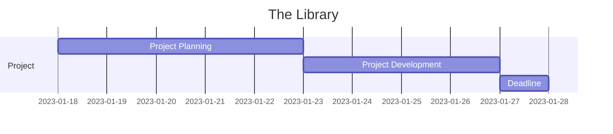

# The Library

The Library is a Java application that allows users to manage a library.

The application is built using Java 17, Maven, Docker, MySQL, JUnit, Jacoco, Mockito and Mermaid.

---

## Design Document

[Design Document](Doc/DESIGN.md)

---

## Tests

---

## How it looks

  

---

## Getting Started

### Prerequisites

- JDK 17
- Maven
- Docker
- MysSQL

### Installing

1. Clone the repository
2. Run `mvn clean install` to build the project
3. Run `docker-compose up` to start the database or `docker-compose f docker-compose.yml up` to start the database in the background. This will start the database on port 3306 and adminer on port 8080.
4. Run `mvn exec:java` to start the application
5. Main method is located in `src/main/java/....../App.java`

---

### Running the tests

Run `mvn test` to run the tests, or `mvn jacoco:prepare-agent test install jacoco:report` to run the tests and generate a coverage report.

---

### MySQL

When running the application for the first time, the database will be created and populated with data from the `schema.sql` file.

### Built With

- [Maven](https://maven.apache.org/) - Dependency Management
- [Docker](https://www.docker.com/) - Containerization
- [MySQL](https://www.mysql.com/) - Database
- [JUnit](https://junit.org/junit5/) - Testing
- [Jacoco](https://www.jacoco.org/jacoco/) - Code Coverage
- [Mockito](https://site.mockito.org/) - Mocking

---

## Project Timeline

---

Back to [JAVA Projects](../README.md)
