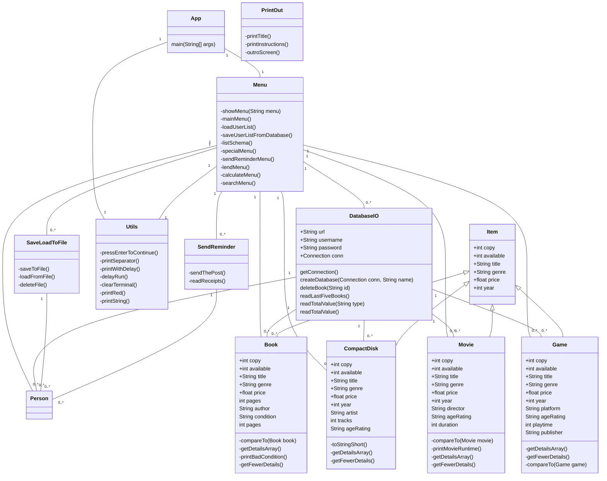

# Design Document

## UML Class Diagram

---

## Nouns & Verbs

---

### Nouns

- Copy
- Available
- Title
- Author
- Year
- Price
- Platform
- Age Rating
- Pages
- Tracks
- Director
- Playtime
- Publisher
- Condition
- Duration
- Book
- Compact Disk
- Movie
- Game
- Genre

---

### Verbs - Actions

- Create a new item
- Delete an item
- Update an item
- List an item
- Search for an item
- Send a reminder
- Calculate the total value of the library
- Get the total value of a type of item
- Save the user list to a file
- Send a reminder
- Lend an item
- List the schema
- List the conditions of the items
- List the runtime of the movies
- List the number of pages of the books
- List the number of tracks of the CDs
- List the email addresses of the users
- Go back to the main menu
- Add a new table to the database
- Delete a table from the database
- List the last five books added to the database
- List the total value of the library
- Save users to a file
- Load users from a file

---

[Back to main page](README.md)
